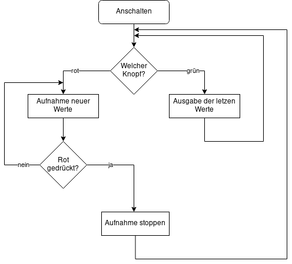
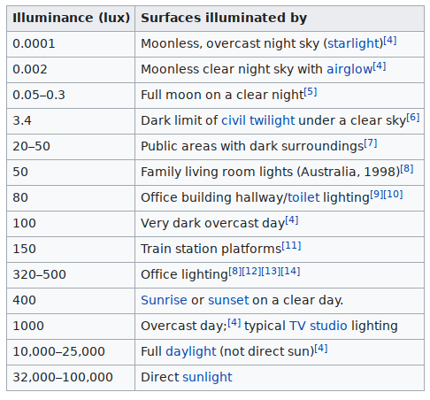

# Sleep Tracking with a Luminance Sensor

## Tasks
- [x] Verify reading a voltage from a GPIO - checked with multimeter
- [x] Read and display the sensor voltage and computed luminance
- [x] Check accuracy of values - values seem to be okay
- [x] Log values - values are logged in NVM / data flash
- [x] Print values on request via UART
- [ ] Clean up code
- [ ] Improve / fix UI
- [ ] Test code, esp. overflow and power loss
 
## Flussdiagramm

## See also
 

 - https://en.wikipedia.org/wiki/Lux
 - https://link.springer.com/article/10.1007/s11818-019-00215-x
